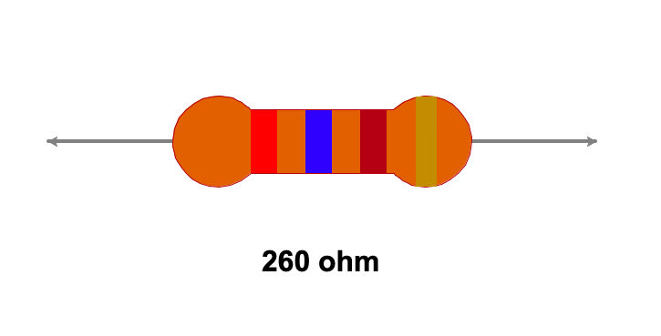

# Resistor Calculator

## Table of contents

- [Overview](#overview)
  - [The challenge](#the-challenge)
  - [Screenshot](#screenshot)
- [My process](#my-process)
  - [Built with](#built-with)
  - [What I learned](#what-i-learned)
  - [Continued development](#continued-development)
- [Author](#author)

## Overview

### The challenge

Users should be able to:

- Enter colors by terminal
- Get the value in numbers of a resistor
- See the colors corresponding to the resistance

### Screenshot

## My process

### Built with

- Python
- Turtle library

### What I learned

I learned how to use lists to group values and make comparisons between entered values.
I also learned to request values from the user console, to be used in the program.
I learned to read text files to get information from them and to be able to use it.
I also learned to use the turtle library to make figures by means of coordinates.

### Continued development

Something that can be integrated in the future is the use of a graphical interface to ask the user for the colors in a more friendly way, in addition, the option of also giving the colors when entering the resistance value can be included.

## Author

Luis David Jimenez Martinez
- Portfolio - [www.luisdavidjm.com](https://www.luisdavidjm.com)
- GitHub - [LuisDavidJM](https://github.com/LuisDavidJM)
